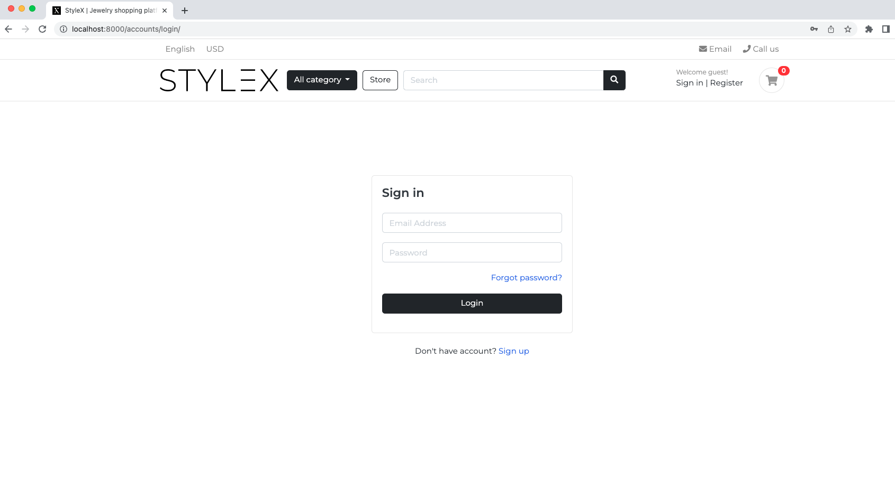

# STYLEX
## An Online Shopping Platform
Built fully-featured Python Django eCommerce website with advanced custom functionalities and RDS Postgres. The application is formed by four app directories and one project directory.


### Initializing all the services
To initialize all the services on a local development environment, simply activate the virtual environment and runserver in terminal with codes below.
```
source ./.venv/bin/activate
python manage.py runserver
```
### Application overview



## All endpoints runs on port 8000
### The accounts app
URLS to access the accounts app:


### The accounts app
URLS to access the accounts app:
- http://localhost:8000/accounts/
- http://localhost:8000/accounts/register/
- http://localhost:8000/accounts/login/
- http://localhost:8000/accounts/logout/
- http://localhost:8000/accounts/dashboard/
- http://localhost:8000/accounts/forgotPassword/
- http://localhost:8000/accounts/activate/<uidb64>/<token>/
- http://localhost:8000/resetPassword_validate/<uidb64>/<token>/
- http://localhost:8000/resetPassword/


### The carts app
URLS to access the carts app:
- http://localhost:8000/cart/
- http://localhost:8000/cart/add_cart/<int:product_id>/
- http://localhost:8000/cart/remove_cart/<int:product_id>/<int:cart_item_id>/
- http://localhost:8000/cart/remove_cart_item/<int:product_id>/<int:cart_item_id>/
- http://localhost:8000/cart/checkout/


### The store app
URLS to access the store app:
- http://localhost:8000/store/
- http://localhost:8000/store/category/<slug:category_slug>/
- http://localhost:8000/store/category/<slug:category_slug>/<slug:product_slug>/
- http://localhost:8000/store/search/
